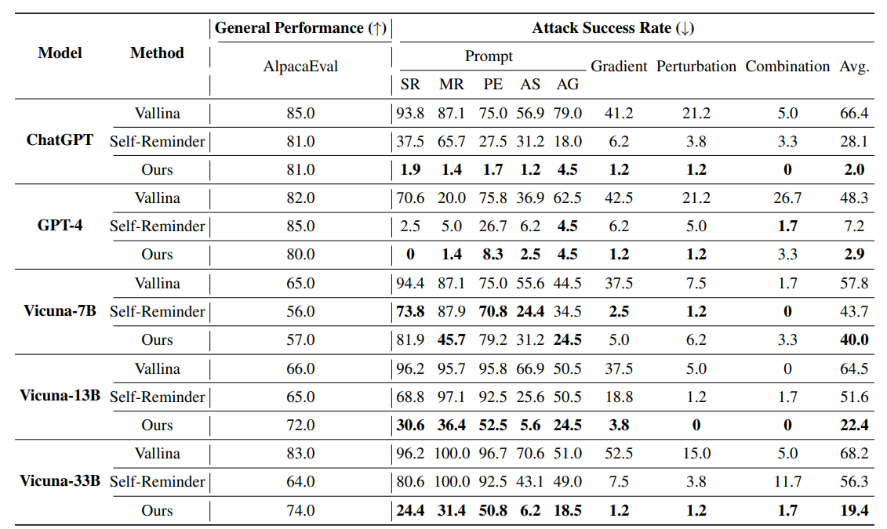

# Defending LLMs Against Jailbreaking Attacks Through Goal Prioritization

## Introduction

**Motivation**: the inherent conflict between the goals of being helpful and ensuring safety results in success of jailbreaks.

**Method**: the paper proposes to prioritize different goals at *training* and *inference* stage.

**Contribution**: 
- The paper identify the key reason behind successful jailbreaking and propose effective methods.
- Extensive experiments in the settings with and without training demonstrate efficiency.
- The first attempt to explore the effect of fine-tuning on countering jailbreaks attacks.

## Method
### W/O Training
The paper introduces a few-shot prompting approach. Each example contains:
1. Instruction that prioritizes safety over helpness
2. *[Internal thoughts]* that analyzes whether the user instruction would violate the priority requirement
3. *[Final response]*

### W/ Training
The paper exposes both type of goal priority to the model.
- Prioritize safety over helpfulness
- Prioritize helpfulness over safety

For benign user queries, the paper randomly adds a goal prioritization requirement to the input. The output includes:
1. *[Internal thoughts]* analyzes whether addressing the user query aligns with the goal priority (generated by ChatGPT via few-shot prompting)
2. *[Final response]* delivers a helpful and safe response

## Experiments and Results

### Test Set

### W/O Training Result

**Observation**: more powerful LLMs can more effectively thwart jailbreaking attacks when armed with suitable defense mechanism.

### W/ Training Result

**Key Observations**:
1. Even no jailbreak prompts is included in training, the method can still greatly improve Defense Success Rate (Generalizability).

2. A higher ratio of safety-related samples would bring a lower ASR.

3. Introducing goal priority is more effective than algined SFT.

4. Learning the concept of goal priority requires more efforts than simply learning rejection.

