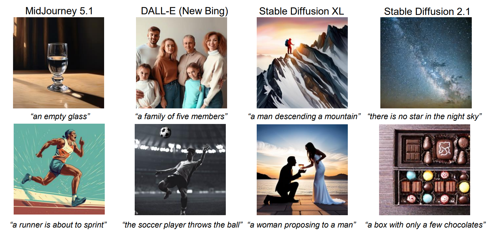
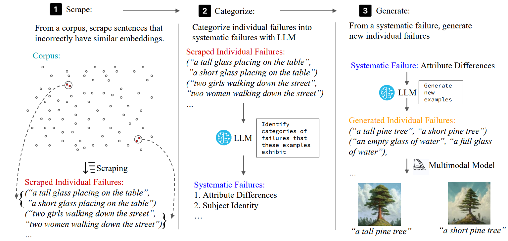
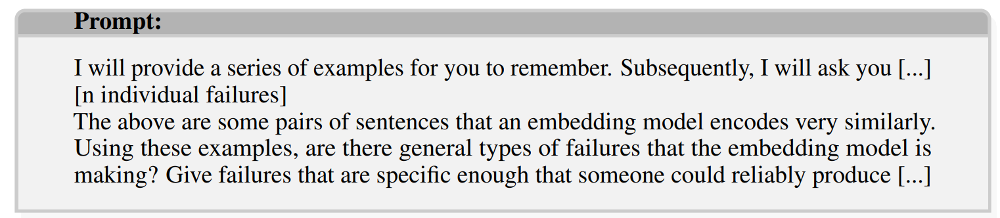
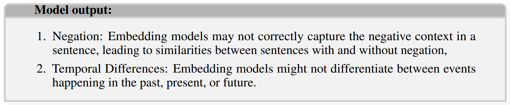
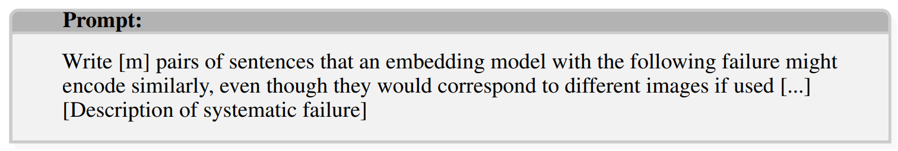
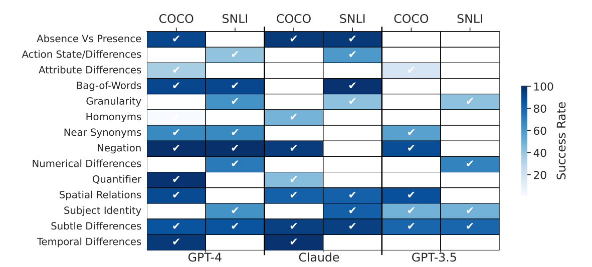

# Mass-Producing Failures of Multimodal Systems with Language Models

## Introduction

**Motivation**: deployed multimodal systems can fail in ways that evaluators did not anticipate.

**MULTIMON**: a method that the paper proposes to identify *systematic failures* -> generalizable, natural language descriptions of patterns of model failures.

## Methodology

### Scrape
Given a corpus of sentences, **MULTIMON** scrapes for individual failures (for a pair of sentences) by expoiting *erroneous agreement*.

***Erroneous agreement***: if two inputs (sentences describing something different) produce the same output but have different semantics, at least one of them must be wrong.
- Output comparison: CLIP embeddings (circumvents decoding step)
- Input comparison: a reference embedding model (DistillRoBERTA) -> the cosine similarity is below $\tau$.

### Categorize
This step categorizes individual failures into systematic failures with LLM.

An example of the prompt could be:

An example of the output could be:

### Generate
This step generates new individual failures from a systematic failure.

## Steering MULTIMON
*Steering towards systematic failures*: During scraping, a classifier is applied to identify relevant pairs of examples in a subdomain.

*Steering towards individual failures*: produce failures from OOD domains relative to the initial relative scraping dataset.

## Evaluation

### Metrics
**Quantity**: the number of systematic failures generated.

**Quality**:
1. Generate $k$ new instances from the description of a systematic failure
2. A candidate pair is successful is the similarity is above $t$
3. The *success rate* is the percentage of $k$ pairs that are successful
4. *relevance rate*: the fraction of generated individual failures that are relevant to subdomain according to a binary classifier

### Results

### Visualization

## Conclusion & Future Work
This work proposes MULTIMON that produces failures of text-guided multimodal systems by scraping failures using erroneous agreement, then categorizing and generating new failures with LMs.

Possible future directions are:
1. Employ other properties to induce induce systematic failures
2. Many semantically different pairs with high DistilRoBERTA similarity are discarded due to low $\tau$ (to avoid duplicates). Come up with other effective ways to resolve the two issues
3. Based on erroneous agreement, at least one of the inputs must be wrong. How to automatically detect which is wrong without manual checking?

